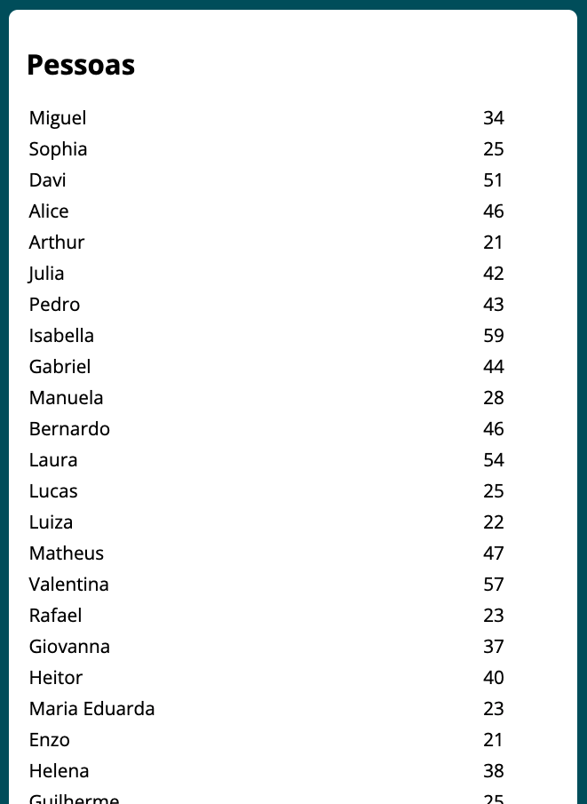
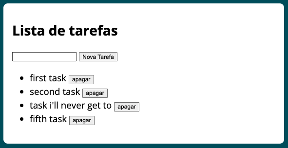
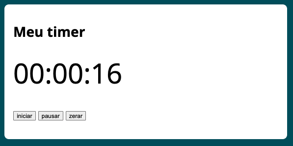

# CursoUdemy
Javascript e TypeScript - front-end e back-end (Full Stack) - Node, Express, noSQL, React, hooks, Redux, Design Patterns

### Screenshots

Calculator
 -------------------------------------------------------------------------------------------------------------------------------------------------------------

BMI Calculator
 -------------------------------------------------------------------------------------------------------------------------------------------------------------

Fetch with Axios
 -------------------------------------------------------------------------------------------------------------------------------------------------------------

Form Validation
 -------------------------------------------------------------------------------------------------------------------------------------------------------------

Task List
 -------------------------------------------------------------------------------------------------------------------------------------------------------------

Timer
 -------------------------------------------------------------------------------------------------------------------------------------------------------------

Repositório pra logar a meteção de 7
Valeu mesmo pro Fredinho que novamente deu força prisso acontecer
