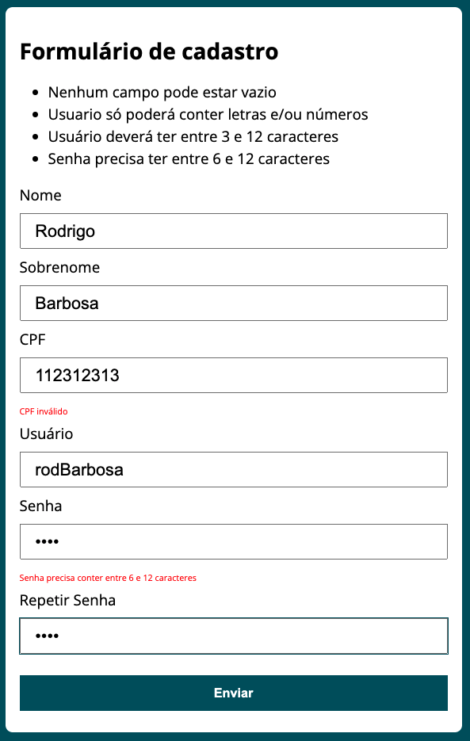

# CursoUdemy
Javascript e TypeScript - front-end e back-end (Full Stack) - Node, Express, noSQL, React, hooks, Redux, Design Patterns

### Screenshots
[Calculator App](https://rodrigo-js-calculator.netlify.app/)
-
[Calculator App Code](https://github.com/Rod-Barbosa/CursoUdemy/tree/main/cursoJS/exercicio_calculadora)
 -------------------------------------------------------------------------------------------------------------------------------------------------------------

[BMI Calculator App](https://rodrigo-js-bmi-app.netlify.app/)
-
[BMI Calculator Code](https://github.com/Rod-Barbosa/CursoUdemy/tree/main/cursoJS/exercicio_IMC)
 -------------------------------------------------------------------------------------------------------------------------------------------------------------

[Task List](https://github.com/Rod-Barbosa/CursoUdemy/tree/main/cursoJS/exercicio_Lista_Tarefas)
 -------------------------------------------------------------------------------------------------------------------------------------------------------------

[Timer](https://github.com/Rod-Barbosa/CursoUdemy/tree/main/cursoJS/exercicio_timer)
 -------------------------------------------------------------------------------------------------------------------------------------------------------------

[Fetch with Axios](https://github.com/Rod-Barbosa/CursoUdemy/tree/main/cursoJS/exercicio_fetch-axios)
 -------------------------------------------------------------------------------------------------------------------------------------------------------------

[Form Validation](https://rodrigo-js-form-validation.netlify.app/)
-
[Form Validation Code](https://github.com/Rod-Barbosa/CursoUdemy/tree/main/cursoJS/exercicio_formulario_validacao/modelo)
 -------------------------------------------------------------------------------------------------------------------------------------------------------------

## Acknowledgments

Repositório pra logar a meteção de 7
Valeu mesmo pro Fredinho que novamente deu força prisso acontecer
